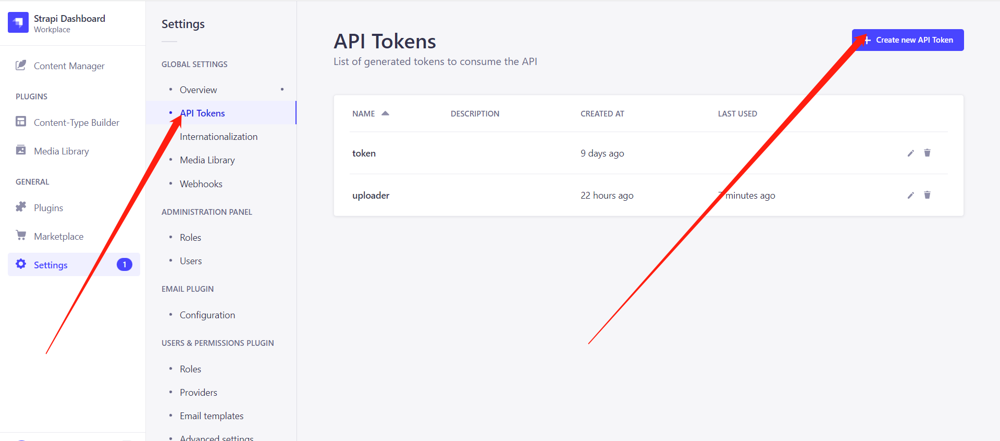
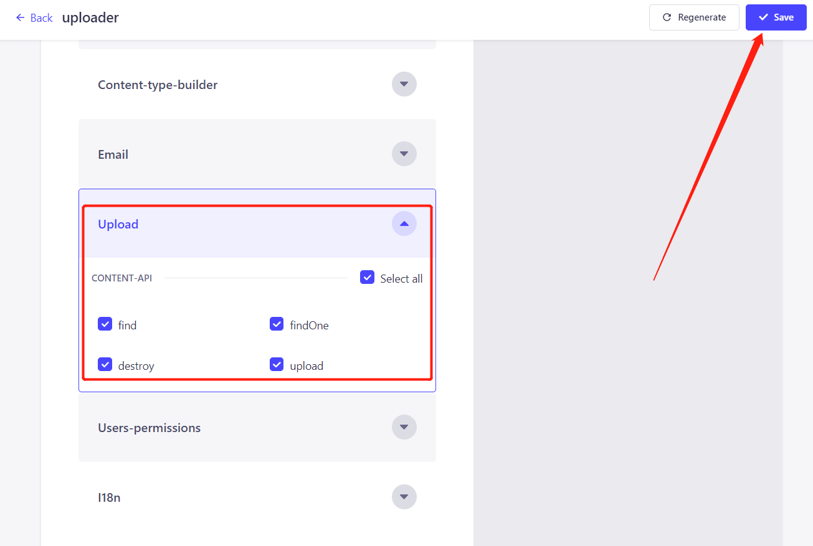
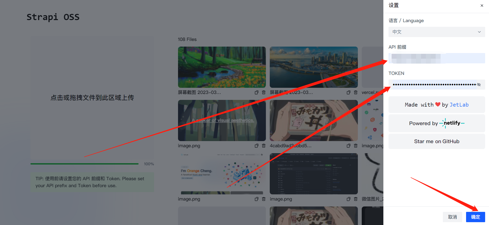

# OSS-Strapi

> 基于 Strapi 实现图床、静态资源上传

- [√] 拖拽上传
- [√] 图片预览
- [√] 删除资源
- [√] 上传进度
- [√] 复制到剪贴板
- [√] Ctrl + V 粘贴上传

## Strapi 介绍

Strapi 是一个开源的 Node.js 内容管理框架，它可以帮助开发者快速搭建 API，而不需要关心数据库的配置、数据模型的定义、数据的增删改查等操作。

我注意到它的文档中有一个 [Upload plugin](https://strapi.io/documentation/3.0.0-beta.x/plugins/upload.html) 插件，它可以帮助我们实现媒体资源的管理，同时借助 Strapi 的 REST API，我们可以利用它实现一个简单的图床。

## Strapi 安装和配置

### 安装  

```bash
# 安装 Strapi
npx create-strapi-app@latest my-img-bed --quickstart
```

启动：  

```bash
# 进入项目目录
cd my-img-bed

# 安装依赖
npm install

# 启动项目
npm run develop
```

### 申请 Token

在 Strapi 后台管理页面，点击左侧的 **Settings**，然后点击 API Token，点击右上角的 **Create Token**，输入 Token 名称，点击 **Save**，然后复制 Token。注意：Token 只会显示一次，如果忘记了，可以重新创建。  



在下方开启 Token 上传权限：  



### 部署到服务器

你需要将你的 Strapi 部署到你的服务器，这样才能开通图床功能。部署的方式非常简单，只需要下面几个步骤：  

1. 安装 pm2
2. 安装 nginx
3. 配置 nginx
4. 配置 pm2，启动 Strapi 项目

假设你部署后，Strapi 的地址是：`http://yourdomain.com`，那么你的 API 前缀就是：`http://yourdomain.com`， 这将在后面的配置中使用。

## OSS-Strapi

有两种方式可以使用 OSS-Strapi，你可以将其克隆到你的服务器并运行，也可以直接访问我部署好的站点 [oss-strapi](https://oss-strapi.netlify.app/)。所有的API、Token都以本地缓存的方式存在浏览器中，并不会上传到我这里，所以你可以放心使用。  

进入 oss-strapi 后，点击右上角的 **Settings**，在 **API Prefix** 中输入你的 Strapi 地址，在 **Token** 中输入你的 Token，点击 **Save**，就可以开始使用了。



你可以在界面中进行上传、删除、复制等操作。  

如果对你有帮助，欢迎 Star 一下，谢谢！
